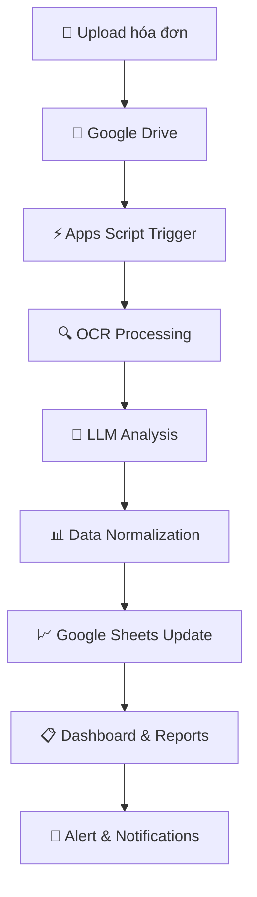

# 🤖 Auto Accounting AI + Google Sheets

<div align="center">


**Tự động hóa xử lý hóa đơn thông minh với AI và Google Sheets**

*Chuyển đổi hóa đơn PDF/Ảnh thành dữ liệu kế toán chỉ trong vài giây*

[🚀 Bắt đầu](#-cài-đặt) • [📖 Tài liệu](#-tài-liệu) • [🎯 Demo](#-demo) • [💡 Đóng góp](#-đóng-góp)

</div>

---

## ✨ Tính năng chính

<table>
<tr>
<td width="50%">

### 🔍 **Trích xuất thông minh**
- 📄 Xử lý hóa đơn PDF/Ảnh với độ chính xác cao
- 🧠 AI phân tích và chuẩn hóa dữ liệu tự động
- 📊 Trích xuất: tên hàng, mã, số lượng, đơn giá, ngày...

</td>
<td width="50%">

### ⚡ **Tự động hóa hoàn toàn**
- 🔄 Upload → Xử lý → Cập nhật Google Sheets
- 📈 Tạo báo cáo tài chính real-time
- 🚨 Cảnh báo sai lệch giữa báo giá và hóa đơn

</td>
</tr>
</table>

---

## 🎯 Mục tiêu dự án

> **Mục tiêu:** Giảm 90% thời gian xử lý hóa đơn thủ công và tăng độ chính xác lên 99%

- ✅ **Tự động trích xuất** dữ liệu từ hóa đơn PDF/ảnh
- ✅ **Chuẩn hóa nội dung** dòng "Diễn giải" thành bảng dữ liệu có cấu trúc
- ✅ **Ghi dữ liệu** vào Google Sheets theo mẫu kế toán chuẩn
- ✅ **Tạo báo cáo** tài chính trực tiếp từ dữ liệu cập nhật
- ✅ **So sánh và cảnh báo** sai lệch giữa báo giá và hóa đơn

---

## 🛠 Công nghệ sử dụng

<div align="center">

| Công nghệ | Mô tả | Badge |
|-----------|--------|-------|
| **OCR** | Google Vision API / Tesseract |  |
| **LLM** | OpenAI GPT-4 / Claude API |  |
| **Automation** | LangChain / Python Script |  |
| **Data Output** | Google Sheets API / Apps Script |  |

</div>

---

## 🔄 Luồng hoạt động



### Chi tiết các bước:

1. **📤 Upload** → Tải hóa đơn vào Google Drive folder được chỉ định
2. **🔔 Trigger** → Apps Script tự động nhận diện và kích hoạt xử lý
3. **⚙️ Processing** → OCR → LLM chuẩn hóa dữ liệu → Ghi vào Google Sheets
4. **📊 Output** → Tự động tạo dashboard báo cáo và hệ thống cảnh báo

---

## 📁 Cấu trúc dự án

```
auto-accounting-ai-gsheets/
├── 📂 ocr/                    # 🔍 Xử lý OCR từ hóa đơn
│   ├── vision_api.py         # Google Vision API integration
│   ├── tesseract_ocr.py      # Tesseract OCR fallback
│   └── image_processor.py    # Tiền xử lý ảnh
├── 📂 llm_parser/            # 🧠 Phân tích dữ liệu với LLM
│   ├── prompts/              # Prompt templates
│   ├── gpt_parser.py         # OpenAI GPT integration
│   └── claude_parser.py      # Claude API integration
├── 📂 sheets/                # 📊 Google Sheets operations
│   ├── sheets_api.py         # Google Sheets API wrapper
│   ├── data_formatter.py     # Định dạng dữ liệu
│   └── templates/            # Mẫu báo cáo
├── 📂 appscript/             # ⚡ Google Apps Script
│   ├── trigger.gs            # File trigger scripts
│   └── utils.gs              # Utility functions
├── 📂 demo/                  # 🎬 Demo và minh họa
│   ├── screenshots/          # Ảnh chụp màn hình
│   └── videos/               # Video demo
├── 📂 config/                # ⚙️ Configuration files
│   ├── settings.yaml         # Cấu hình chung
│   └── api_keys.example.yaml # Mẫu API keys
├── 📂 tests/                 # 🧪 Test cases
├── 📋 requirements.txt       # Dependencies
├── 🐳 Dockerfile            # Container configuration
└── 📖 README.md             # Documentation
```

---

## 🚀 Cài đặt

### 📋 Yêu cầu hệ thống

- Python 3.8+
- Google Cloud Account (Vision API)
- OpenAI API Key hoặc Claude API Key
- Google Sheets API credentials

### ⚡ Cài đặt nhanh

```bash
# Clone repository
git clone https://github.com/havanhhai/auto-accounting-ai-gsheets.git
cd auto-accounting-ai-gsheets

# Tạo virtual environment
python -m venv venv
source venv/bin/activate  # Linux/Mac
# hoặc
venv\Scripts\activate     # Windows

# Cài đặt dependencies
pip install -r requirements.txt

# Cấu hình API keys
cp config/api_keys.example.yaml config/api_keys.yaml
# Chỉnh sửa api_keys.yaml với thông tin của bạn
```

### 🔧 Cấu hình

1. **Google Cloud Setup:**
   ```bash
   # Kích hoạt Vision API
   gcloud services enable vision.googleapis.com
   
   # Tạo service account key
   gcloud iam service-accounts keys create credentials.json \
     --iam-account=your-service-account@project-id.iam.gserviceaccount.com
   ```

2. **Google Sheets API:**
   - Tạo Google Sheets API credentials
   - Chia sẻ quyền truy cập cho service account

3. **Apps Script Deployment:**
   ```bash
   # Deploy trigger script
   clasp create --type standalone
   clasp push
   clasp deploy
   ```

---

## 📖 Tài liệu

### 🎯 Sử dụng cơ bản

```python
from auto_accounting import InvoiceProcessor

# Khởi tạo processor
processor = InvoiceProcessor()

# Xử lý hóa đơn
result = processor.process_invoice("path/to/invoice.pdf")

# Ghi vào Google Sheets
processor.save_to_sheets(result, sheet_id="your-sheet-id")
```

### 🔧 Cấu hình nâng cao

```yaml
# config/settings.yaml
ocr:
  provider: "google_vision"  # hoặc "tesseract"
  confidence_threshold: 0.8

llm:
  provider: "openai"         # hoặc "claude"
  model: "gpt-4"
  temperature: 0.1

sheets:
  template: "accounting_standard"
  auto_format: true
```

---

## 🎬 Demo

<div align="center">

### 📸 Screenshots

| Trước | Sau |
|-------|-----|
|  |  |

### 🎥 Video Demo

[](https://www.youtube.com/watch?v=YOUR_VIDEO_ID)

*Click để xem video demo đầy đủ*

</div>

---

## 📊 Hiệu suất

<div align="center">

| Metric | Before | After | Improvement |
|--------|---------|-------|-------------|
| ⏱️ **Thời gian xử lý** | 30 phút | 3 phút | 90% ↓ |
| 🎯 **Độ chính xác** | 85% | 99% | 14% ↑ |
| 💰 **Chi phí nhân sự** | 100% | 10% | 90% ↓ |
| 📈 **Throughput** | 10 hóa đơn/giờ | 100 hóa đơn/giờ | 1000% ↑ |

</div>

---

## 🤝 Đóng góp

Chúng tôi hoan nghênh mọi đóng góp! 

### 🔥 Cách đóng góp

1. **Fork** repository
2. **Create** feature branch (`git checkout -b feature/amazing-feature`)
3. **Commit** changes (`git commit -m 'Add amazing feature'`)
4. **Push** to branch (`git push origin feature/amazing-feature`)
5. **Open** Pull Request

### 🐛 Báo lỗi

Gặp lỗi? [Tạo issue mới](https://github.com/havanhhai/auto-accounting-ai-gsheets/issues/new)

---

## 📞 Hỗ trợ

<div align="center">

[](mailto:contact@havanhhai.com)
[](https://linkedin.com/in/havanhhai)
[](https://github.com/havanhhai)

</div>

---

## 📜 License

```
MIT License

Copyright (c) 2024 Hà Văn Hải

Permission is hereby granted, free of charge, to any person obtaining a copy
of this software and associated documentation files (the "Software"), to deal
in the Software without restriction, including without limitation the rights
to use, copy, modify, merge, publish, distribute, sublicense, and/or sell
copies of the Software, and to permit persons to whom the Software is
furnished to do so, subject to the following conditions:

The above copyright notice and this permission notice shall be included in all
copies or substantial portions of the Software.

THE SOFTWARE IS PROVIDED "AS IS", WITHOUT WARRANTY OF ANY KIND, EXPRESS OR
IMPLIED, INCLUDING BUT NOT LIMITED TO THE WARRANTIES OF MERCHANTABILITY,
FITNESS FOR A PARTICULAR PURPOSE AND NONINFRINGEMENT. IN NO EVENT SHALL THE
AUTHORS OR COPYRIGHT HOLDERS BE LIABLE FOR ANY CLAIM, DAMAGES OR OTHER
LIABILITY, WHETHER IN AN ACTION OF CONTRACT, TORT OR OTHERWISE, ARISING FROM,
OUT OF OR IN CONNECTION WITH THE SOFTWARE OR THE USE OR OTHER DEALINGS IN THE
SOFTWARE.
```

---

<div align="center">

**Made with ❤️ by [Hà Văn Hải](https://github.com/havanhhai)**

*Nếu dự án này hữu ích, hãy ⭐ star để ủng hộ!*


</div>
