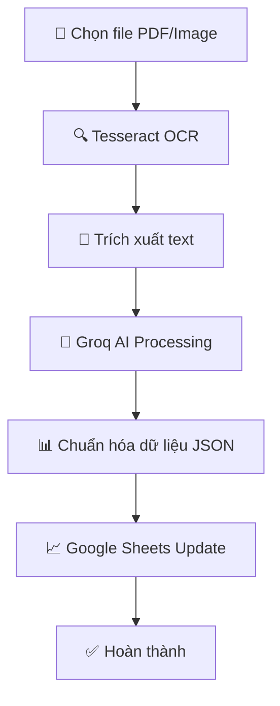

# 🤖 Auto Accounting AI + Google Sheets

<div align="center">


**Tự động hóa xử lý hóa đơn thông minh với AI và Google Sheets**

*Chuyển đổi hóa đơn PDF/Ảnh thành dữ liệu kế toán chỉ trong vài giây*

[🚀 Bắt đầu](#-cài-đặt) • [📖 Tài liệu](#-tài-liệu) • [💡 Đóng góp](#-đóng-góp)

</div>

---

## ✨ Tính năng chính

<table>
<tr>
<td width="50%">

### 🔍 **Trích xuất thông minh**
- 📄 Xử lý hóa đơn PDF/Ảnh với độ chính xác cao
- 🧠 AI phân tích và chuẩn hóa dữ liệu tự động
- 📊 Trích xuất: tên hàng, mã, số lượng, đơn giá, ngày...

</td>
<td width="50%">

### ⚡ **Tự động hóa hoàn toàn**
- 🔄 CLI đơn giản: Upload → Xử lý → Cập nhật Google Sheets
- 📈 Tạo dữ liệu kế toán có cấu trúc
- 🚨 Xử lý batch nhiều file cùng lúc

</td>
</tr>
</table>

---

## ⚠️ **Lưu ý quan trọng**

> **🔒 Bảo mật:** Không bao giờ commit file `.env` hoặc `service_account.json` lên repository!
> 
> **📝 Cấu hình:** Luôn sử dụng file `.env` để lưu API keys và thông tin nhạy cảm

---

## 🎯 Mục tiêu dự án

> **Mục tiêu:** Giảm 90% thời gian xử lý hóa đơn thủ công và tăng độ chính xác lên 99%

- ✅ **Tự động trích xuất** dữ liệu từ hóa đơn PDF/ảnh
- ✅ **Chuẩn hóa nội dung** dòng "Diễn giải" thành bảng dữ liệu có cấu trúc
- ✅ **Ghi dữ liệu** vào Google Sheets theo mẫu kế toán chuẩn
- ✅ **Tạo báo cáo** tài chính trực tiếp từ dữ liệu cập nhật
- ✅ **So sánh và cảnh báo** sai lệch giữa báo giá và hóa đơn

---

## 🛠 Công nghệ sử dụng

<div align="center">

| Công nghệ | Mô tả | Badge |
|-----------|--------|-------|
| **OCR** | Tesseract OCR |  |
| **LLM** | Groq API (Llama3/Mixtral) |  |
| **Automation** | Python Script |  |
| **Data Output** | Google Sheets API |  |

</div>

---

## 🔄 Luồng hoạt động



### Chi tiết các bước:

1. **📤 Input** → Chọn file hóa đơn (PDF/PNG/JPG) hoặc thư mục chứa nhiều file
2. **🔍 OCR** → Tesseract trích xuất text từ hóa đơn
3. **🧠 AI Processing** → Groq API phân tích và chuẩn hóa dữ liệu
4. **📊 Output** → Tự động ghi dữ liệu vào Google Sheets

---

## 📁 Cấu trúc dự án
```
auto-accounting-ai-gsheets/
├── 📂 appscript/            # Scripts Google Apps Script (planned)
├── 📂 config/               # Cấu hình dự án
├── 📂 demo/                 # Thư mục demo và minh họa
├── 📂 llm_parser/           # Phân tích dữ liệu với Groq API
├── 📂 logs/                 # Nhật ký xử lý
├── 📂 ocr/                  # Xử lý OCR từ hóa đơn với Tesseract
├── 📂 sheets/               # Tác vụ liên quan Google Sheets
├── 📂 tests/                # Trường hợp kiểm thử
├── 📂 utils/                # Hàm tiện ích
├── 📄 .env                  # Biến môi trường (không commit)
├── 📄 .env.example          # Mẫu cấu hình biến môi trường
├── 📄 .gitignore            # Tập tin bị bỏ qua bởi Git
├── 📄 Dockerfile            # Cấu hình container
├── 📄 main.py               # Điểm vào chính của ứng dụng
├── 📄 README.md             # Tài liệu dự án
├── 📄 requirements.txt      # Danh sách phụ thuộc
├── 📄 run.py                # Kịch bản chạy CLI
```

---

## 🚀 Cài đặt

### 📋 Yêu cầu hệ thống

- Python 3.8+
- Tesseract OCR
- Groq API Key
- Google Sheets API credentials

### ⚡ Cài đặt nhanh

```bash
# Clone repository
git clone https://github.com/vanhai1231/auto-accounting-ai-gsheets.git
cd auto-accounting-ai-gsheets

# Tạo virtual environment
python -m venv venv
source venv/bin/activate  # Linux/Mac
# hoặc
venv\Scripts\activate     # Windows

# Cài đặt dependencies
pip install -r requirements.txt

# Cài đặt Tesseract OCR
# Ubuntu/Debian:
sudo apt-get install tesseract-ocr tesseract-ocr-vie
# MacOS:
brew install tesseract tesseract-lang
# Windows: Download từ https://github.com/UB-Mannheim/tesseract/wiki
```

### 🔧 Cấu hình

1. **Tạo file .env từ mẫu:**
   ```bash
   cp .env.example .env
   ```

2. **Chỉnh sửa file .env:**
   ```env
   # Groq API Configuration
   GROQ_API_KEY=your_groq_api_key_here
   GROQ_MODEL=llama3-8b-8192
   
   # Google Sheets Configuration
   GOOGLE_SHEETS_ID=your_google_sheets_id_here
   GOOGLE_CREDENTIALS_FILE=service_account.json
   
   # OCR Configuration
   TESSERACT_PATH=/usr/bin/tesseract
   OCR_LANGUAGE=vie+eng
   
   # Processing Configuration
   MAX_RETRIES=3
   BATCH_SIZE=10
   ```

3. **Tạo Google Sheets API credentials:**
   ```bash
   # Tải service account JSON từ Google Cloud Console
   cp service_account.example.json service_account.json
   # Thay thế nội dung bằng credentials thật của bạn
   ```

4. **Tạo Google Sheets và chia sẻ quyền:**
   - Tạo Google Sheets mới
   - Chia sẻ quyền "Editor" cho email trong service_account.json
   - Copy Sheet ID từ URL vào file .env

---

## 💡 Sử dụng

### 🎯 Các lệnh CLI cơ bản

```bash
# Xử lý một file đơn lẻ
python run.py --file invoices/sample_invoice.pdf

# Xử lý tất cả file trong thư mục
python run.py --folder invoices/

# Xử lý với tùy chọn nâng cao
python run.py --file invoice.pdf --sheet-id "your_sheet_id" --verbose

# Hiển thị trợ giúp
python run.py --help
```

### 🔧 Tùy chọn command line

| Tùy chọn | Mô tả | Ví dụ |
|----------|--------|-------|
| `--file` | Xử lý một file cụ thể | `--file invoice.pdf` |
| `--folder` | Xử lý tất cả file trong thư mục | `--folder ./invoices/` |
| `--sheet-id` | ID của Google Sheet (ghi đè .env) | `--sheet-id "1ABC...xyz"` |
| `--verbose` | Hiển thị log chi tiết | `--verbose` |
| `--dry-run` | Chạy thử không ghi vào Sheets | `--dry-run` |

### 📄 Ví dụ file .env.example

```env
# =================================
# GROQ API CONFIGURATION
# =================================
# Lấy API key từ: https://console.groq.com/keys
GROQ_API_KEY=gsk_your_api_key_here

# Model options: llama3-8b-8192, llama3-70b-8192, mixtral-8x7b-32768
GROQ_MODEL=llama3-8b-8192

# =================================
# GOOGLE SHEETS CONFIGURATION  
# =================================
# Google Sheets ID (từ URL: docs.google.com/spreadsheets/d/{SHEET_ID}/edit)
GOOGLE_SHEETS_ID=1ABCdefGHIjklMNOpqrSTUvwxYZ0123456789

# Đường dẫn đến file credentials JSON
GOOGLE_CREDENTIALS_FILE=service_account.json

# Tên worksheet trong Google Sheets
WORKSHEET_NAME=Invoices

# =================================
# OCR CONFIGURATION
# =================================
# Đường dẫn đến Tesseract (có thể để trống nếu đã add vào PATH)
TESSERACT_PATH=

# Ngôn ngữ OCR (vie=Tiếng Việt, eng=English)
OCR_LANGUAGE=vie+eng

# =================================
# PROCESSING CONFIGURATION
# =================================
# Số lần thử lại khi gặp lỗi
MAX_RETRIES=3

# Số file xử lý đồng thời (batch processing)
BATCH_SIZE=10

# Timeout cho API calls (giây)
API_TIMEOUT=60
```

---

## 📊 Định dạng dữ liệu đầu ra

Dữ liệu sẽ được ghi vào Google Sheets với các cột:

| Cột | Mô tả | Ví dụ |
|-----|--------|-------|
| **Ngày hóa đơn** | Ngày xuất hóa đơn | 15/12/2024 |
| **Số hóa đơn** | Số/ký hiệu hóa đơn | HD001234 |
| **Nhà cung cấp** | Tên công ty bán | Công ty ABC |
| **Mã hàng** | Mã sản phẩm/dịch vụ | SP001 |
| **Tên hàng** | Tên sản phẩm/dịch vụ | Máy tính xách tay |
| **Số lượng** | Số lượng | 2 |
| **Đơn vị** | Đơn vị tính | cái |
| **Đơn giá** | Giá một đơn vị | 15,000,000 |
| **Thành tiền** | Tổng tiền dòng | 30,000,000 |
| **VAT (%)** | % thuế VAT | 10% |
| **Tổng tiền** | Tổng hóa đơn | 33,000,000 |

---

## 🤝 Đóng góp

Chúng tôi hoan nghênh mọi đóng góp! 

### 🔥 Cách đóng góp

1. **Fork** repository
2. **Create** feature branch (`git checkout -b feature/amazing-feature`)
3. **Commit** changes (`git commit -m 'Add amazing feature'`)
4. **Push** to branch (`git push origin feature/amazing-feature`)
5. **Open** Pull Request

### 🐛 Báo lỗi

Gặp lỗi? [Tạo issue mới](https://github.com/vanhai1231/auto-accounting-ai-gsheets/issues/new)

---

## 📦 Roadmap & Planned Features

### 🚀 Phiên bản hiện tại (v1.0)
- ✅ CLI interface cơ bản
- ✅ Tesseract OCR integration
- ✅ Groq API integration  
- ✅ Google Sheets API
- ✅ Batch processing

### 📌 Kế hoạch phát triển

#### 🔄 v1.1 - Automation & Triggers
- 📁 Google Drive integration
- ⚡ Apps Script triggers tự động
- 🔔 Email notifications

#### 🎨 v1.2 - UI & Dashboard  
- 🌐 Web interface
- 📊 Dashboard & reporting
- 📈 Analytics & insights

#### 🧠 v1.3 - Advanced AI
- 🔍 Google Vision API integration
- 🤖 Claude API support
- 📋 Multi-language support

#### 🔧 v2.0 - Enterprise Features
- 🔐 User authentication
- 👥 Multi-tenant support
- 📊 Advanced reporting
- 🔄 Workflow automation

---

## 📞 Hỗ trợ

<div align="center">

[](https://github.com/vanhai1231/auto-accounting-ai-gsheets/issues)
[](mailto:vanhai1231@gmail.com)

</div>

---

## 📜 License

```
MIT License

Copyright (c) 2025 Hà Văn Hải

Permission is hereby granted, free of charge, to any person obtaining a copy
of this software and associated documentation files (the "Software"), to deal
in the Software without restriction, including without limitation the rights
to use, copy, modify, merge, publish, distribute, sublicense, and/or sell
copies of the Software, and to permit persons to whom the Software is
furnished to do so, subject to the following conditions:

The above copyright notice and this permission notice shall be included in all
copies or substantial portions of the Software.

THE SOFTWARE IS PROVIDED "AS IS", WITHOUT WARRANTY OF ANY KIND, EXPRESS OR
IMPLIED, INCLUDING BUT NOT LIMITED TO THE WARRANTIES OF MERCHANTABILITY,
FITNESS FOR A PARTICULAR PURPOSE AND NONINFRINGEMENT. IN NO EVENT SHALL THE
AUTHORS OR COPYRIGHT HOLDERS BE LIABLE FOR ANY CLAIM, DAMAGES OR OTHER
LIABILITY, WHETHER IN AN ACTION OF CONTRACT, TORT OR OTHERWISE, ARISING FROM,
OUT OF OR IN CONNECTION WITH THE SOFTWARE OR THE USE OR OTHER DEALINGS IN THE
SOFTWARE.
```

---

<div align="center">

**Made with ❤️ by [Hà Văn Hải](https://github.com/vanhai1231)**

*Nếu dự án này hữu ích, hãy ⭐ star để ủng hộ!*


</div>